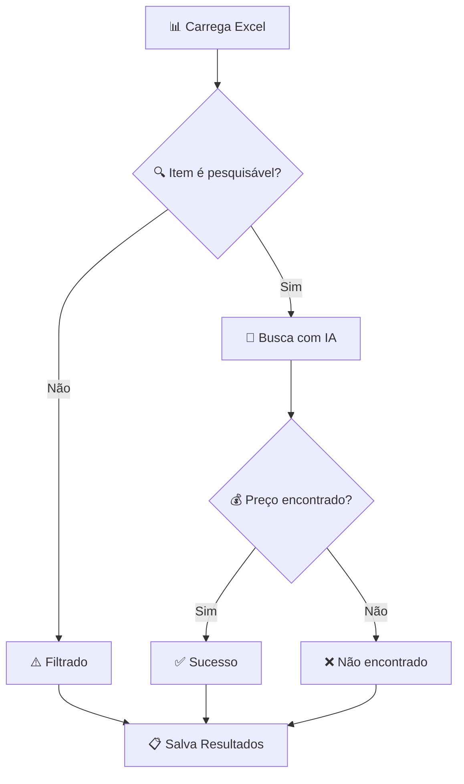

# 🔍 Sistema de Descoberta de Preços

[](https://www.python.org/downloads/)
[](LICENSE)
[](https://www.perplexity.ai/)
[]()

Buscador de preços para produtos brasileiros usando **Perplexity AI**. Processa planilhas Excel e retorna preços exatos de e-commerces brasileiros.

---

## 📋 Índice

- [🚀 Início Rápido](#-início-rápido)
- [⚡ Arquitetura](#-arquitetura)
- [🛠️ Instalação Completa](#️-instalação-completa)
- [📖 Tutorial de Uso](#-tutorial-de-uso)
- [📊 Resultados](#-resultados)
- [🔧 Configuração Avançada](#-configuração-avançada)
- [❓ Solução de Problemas](#-solução-de-problemas)
- [🤝 Contribuição](#-contribuição)

---

## 📋 Requisitos

- Python 3.8+
- Arquivo Excel: `lista.xlsx`
- Conexão com internet

## 🚀 Início Rápido

```bash
# 1. Clone o repositório
git clone https://github.com/XSirch/lista-de-compras
cd price-discovery-system

# 2. Instale as dependências
pip install -r requirements.txt

# 3. Configure sua API key
cp .env.example .env
# Edite o arquivo .env com sua chave da Perplexity AI

# 4. Execute o sistema
python price_discovery.py
```

> ⏱️ **Tempo total**: ~3 minutos para configuração + tempo de processamento

---

## ⚡ Arquitetura

### 🎯 **Solução de Arquivo Único**

Este sistema foi projetado com **arquitetura limpa** e **responsabilidade única**:

```
price_discovery.py
├── 🔍 Validação Integrada    # Filtra itens genéricos automaticamente
├── 🤖 Busca com IA          # Perplexity AI para múltiplas lojas
├── 📊 Geração de Resultados # Excel com dados estruturados
└── ⚡ Zero Duplicação       # Toda lógica centralizada
```

---

## 🛠️ Instalação Completa

### 📋 **Pré-requisitos**

- **Python 3.8+** ([Download](https://www.python.org/downloads/))
- **Chave API da Perplexity AI** ([Obter aqui](https://www.perplexity.ai/settings/api))
- **Planilha Excel** com coluna "Item"

### 🔧 **Passo a Passo**

<details>
<summary><strong>1. 📥 Preparação do Ambiente</strong></summary>

```bash
# Clone o repositório
git clone https://github.com/XSirch/lista-de-compras
cd price-discovery-system

# Crie um ambiente virtual (recomendado)
python -m venv .venv

# Ative o ambiente virtual
# Windows:
.venv\Scripts\activate
# Linux/Mac:
source .venv/bin/activate

# Instale as dependências
pip install -r requirements.txt
```

</details>

<details>
<summary><strong>2. 🔑 Configuração da API</strong></summary>

```bash
# Copie o arquivo de exemplo
cp .env.example .env

# Edite o arquivo .env
# Windows: notepad .env
# Linux/Mac: nano .env
```

**Conteúdo do arquivo `.env`:**

```env
# Chave API da Perplexity AI
PERPLEXITY_API_KEY=pplx-sua-chave-aqui

# Nome do arquivo de entrada (opcional)
INPUT_FILE=lista.xlsx
```

> 💡 **Dica**: Obtenha sua chave API gratuita em [perplexity.ai/settings/api](https://www.perplexity.ai/settings/api)

</details>

<details>
<summary><strong>3. 📊 Preparação dos Dados</strong></summary>

**Formato da Planilha Excel:**

- **Nome do arquivo**: `lista.xlsx` (ou configure no `.env`)
- **Coluna obrigatória**: `Item` com descrições dos produtos
- **Localização**: Mesma pasta do script

**Exemplo de estrutura:**

```
| Item                          |
|-------------------------------|
| Notebook Dell Inspiron 15    |
| Mouse Gamer Logitech          |
| Monitor 24 polegadas          |
| Materiais de escritório       |
```

</details>

---

## 📖 Tutorial de Uso

### ▶️ **Execução Básica**

```bash
python price_discovery.py
```

### 📱 **Exemplo de Execução**

```bash
$ python price_discovery.py
2025-01-14 10:30:15 - INFO - 🚀 Starting Price Discovery System
2025-01-14 10:30:15 - INFO - 📂 Loading Excel file: lista.xlsx
2025-01-14 10:30:16 - INFO - 🔢 Processing 20 items...
2025-01-14 10:30:16 - INFO - 🤖 Searching: Notebook Dell Inspiron 15...
2025-01-14 10:30:19 - INFO - ✅ [1] FOUND: R$ 3.609,05 - Buscapé
2025-01-14 10:30:22 - INFO - 🤖 Searching: Mouse Gamer Logitech...
2025-01-14 10:30:24 - INFO - ✅ [2] FOUND: R$ 999,90 - Logitech Store
2025-01-14 10:30:27 - INFO - ⚠️ [3] FILTERED: Materiais de escritório
...
2025-01-14 10:35:42 - INFO - 📊 SUMMARY: 15 found, 3 filtered, 2 not found
2025-01-14 10:35:42 - INFO - 🎯 Success rate: 75.0% of total items
2025-01-14 10:35:42 - INFO - 💾 Results saved to: Resultado_20250114_103542.xlsx
```

### 🔄 **Fluxo de Processamento**



**Critérios de Validação:**

- ✅ **Pesquisável**: Produtos específicos com marca/modelo
- ⚠️ **Filtrado**: Termos genéricos ("materiais de escritório", "serviços gerais")
- ❌ **Não encontrado**: Produto específico sem preço disponível

---

## 📊 Resultados

### 📋 **Arquivo de Saída**

O sistema gera um arquivo Excel com timestamp: `Resultado_YYYYMMDD_HHMMSS.xlsx`

### 📈 **Estrutura dos Dados**

| Coluna               | Descrição             | Exemplo                                          |
| -------------------- | ----------------------- | ------------------------------------------------ |
| **Item**       | Descrição original    | "Notebook Dell Inspiron 15"                      |
| **Status**     | Status do processamento | `price_found`, `filtered_out`, `not_found` |
| **Reason**     | Motivo do resultado     | "Found via AI search"                            |
| **Price**      | Preço em R$            | 3609.05                                          |
| **Store**      | Nome da loja            | "Buscapé"                                       |
| **URL**        | Link do produto         | "https://..."                                    |
| **Confidence** | Confiança (0-1)        | 0.95                                             |

### 📊 **Métricas de Performance**

**Taxa de Sucesso Típica:**

- 🎯 **60-80%** dos itens pesquisáveis encontram preços
- ⚡ **30-40%** dos itens são filtrados (economia de API)
- 🔍 **5-15%** não encontram preços específicos

**Fontes de Dados:**

- 🛒 Mercado Livre, Americanas, Magazine Luiza
- 🏪 Buscapé, Zoom, lojas oficiais
- 🤖 Validação por IA para precisão

---

## 🔧 Configuração Avançada

<details>
<summary><strong>⚙️ Variáveis de Ambiente</strong></summary>

**Arquivo `.env` completo:**

```env
# 🔑 OBRIGATÓRIO: Chave API da Perplexity AI
PERPLEXITY_API_KEY=pplx-sua-chave-aqui

# 📁 OPCIONAL: Nome do arquivo de entrada
INPUT_FILE=lista.xlsx
```

</details>

<details>
<summary><strong>🎛️ Personalização do Sistema</strong></summary>

**Modificações no código `price_discovery.py`:**

```python
# Rate limiting (linha ~290)
time.sleep(3)  # Altere para ajustar velocidade

# Timeout das requisições (linha ~180)
timeout=30  # Altere para requisições mais longas

# Modelo de IA (linha ~175)
"model": "sonar-pro"  # Opções: sonar, sonar-pro
```

</details>

<details>
<summary><strong>🔍 Critérios de Validação</strong></summary>

**Itens Automaticamente Filtrados:**

```python
# Termos genéricos
❌ "materiais de escritório"
❌ "serviços gerais"
❌ "comunicação visual"

# Serviços
❌ "instalação"
❌ "consultoria"
❌ "manutenção"
```

**Itens Considerados Pesquisáveis:**

```python
# Marcas específicas
✅ "Dell", "Samsung", "Brastemp"

# Especificações técnicas
✅ "24 polegadas", "128GB", "inverter"

# Categorias específicas
✅ "notebook", "geladeira", "smartphone"
```

</details>

---

## ❓ Solução de Problemas

<details>
<summary><strong>🚨 Problemas Comuns</strong></summary>

### **Erro: "PERPLEXITY_API_KEY not found"**

```bash
# Solução:
1. Verifique se o arquivo .env existe
2. Confirme se a chave está correta
3. Reinicie o terminal após editar .env
```

### **Erro: "Input file not found"**

```bash
# Solução:
1. Verifique se o arquivo Excel está na pasta correta
2. Confirme o nome no .env: INPUT_FILE=seu-arquivo.xlsx
3. Verifique se tem a coluna "Item"
```

### **Taxa de sucesso baixa (<30%)**

```bash
# Possíveis causas:
1. Itens muito genéricos na planilha
2. Descrições muito curtas ou vagas
3. Produtos muito específicos/raros

# Solução:
- Melhore as descrições dos produtos
- Adicione marcas e modelos específicos
```

### **Erro 401: Unauthorized**

```bash
# Solução:
1. Verifique se a chave API está válida
2. Confirme se tem créditos na conta Perplexity
3. Teste a chave em: https://www.perplexity.ai/settings/api
```

</details>

<details>
<summary><strong>🐛 Debug e Logs</strong></summary>

**Ativar logs detalhados:**

```python
# Altere no início do price_discovery.py:
logging.basicConfig(level=logging.DEBUG)
```

**Testar com poucos itens:**

```python
# Limite o processamento para teste:
# Na linha ~280, adicione:
if i >= 5:  # Processa apenas 5 itens
    break
```

</details>

---

## 🤝 Contribuição

### 🛠️ **Estrutura do Código**

```python
price_discovery.py
├── PriceResult          # Dataclass para resultados
├── PriceDiscoverySystem # Classe principal
│   ├── _is_searchable() # Validação integrada
│   ├── _search_with_ai() # Busca com Perplexity AI
│   └── process_item()   # Processamento completo
└── main()               # Função de entrada
```

### 📋 **Como Contribuir**

1. **Fork** o repositório
2. **Crie** uma branch para sua feature (`git checkout -b feature/nova-funcionalidade`)
3. **Commit** suas mudanças (`git commit -am 'Adiciona nova funcionalidade'`)
4. **Push** para a branch (`git push origin feature/nova-funcionalidade`)
5. **Abra** um Pull Request

### 🎯 **Diretrizes**

- ✅ Mantenha a **arquitetura de arquivo único**
- ✅ Adicione **testes** para novas funcionalidades
- ✅ Siga o **padrão de logging** existente
- ✅ Documente **mudanças** no README

---

## 📄 Licença

Este projeto está licenciado sob a **MIT License** - veja o arquivo [LICENSE](LICENSE) para detalhes.

---

## 🙏 Agradecimentos

- **[Perplexity AI](https://www.perplexity.ai/)** - Pela API de busca inteligente
- **Comunidade Python** - Pelas bibliotecas utilizadas
- **Contribuidores** - Por melhorias e feedback

---

<div align="center">

**⭐ Se este projeto foi útil, considere dar uma estrela!**

[](https://github.com/username/price-discovery-system)

</div>
