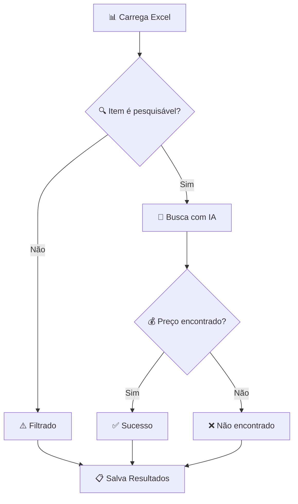

# 🔍 Sistema de Descoberta de Preços v2.0

[](https://www.python.org/downloads/)
[](LICENSE)
[](https://www.perplexity.ai/)
[](https://www.crewai.com/)
[]()

Sistema de busca de preços para produtos brasileiros com **otimização por IA**. Combina **CrewAI** para pré-processamento  e **Perplexity AI** para busca de preços, garantindo máxima precisão e eficiência.

## 🚀 **Novidades da Versão 2.0**

### ✨ **Principais Melhorias:**

- **🤖 Pré-processamento Inteligente**: Agentes CrewAI otimizam descrições automaticamente
- **📝 Localização Completa**: Todos os componentes em português brasileiro
- **⚡ Arquitetura Simplificada**: Redução de 500+ para ~180 linhas de código
- **🎯 Foco no Valor**: Eliminação de validações redundantes, foco na otimização por IA
- **💰 Economia de Tokens**: Dois modos de uso para otimizar custos de API

### 🔄 **Mudanças Técnicas:**

- **Adicionado**: Sistema CrewAI para otimização inteligente de descrições
- **Removido**: Lógica de validação duplicada e dependências desnecessárias
- **Melhorado**: Terminologia brasileira e contexto automático para produtos
- **Otimizado**: Fluxo de trabalho com fallback para otimização básica

### 📈 **Exemplos de Otimização por IA:**

- `mouse` → `Mouse óptico para computador com fio`
- `ar condicionado 12000 btus` → `Ar condicionado split 12000 BTUs`
- `micro ondas 20 litros` → `Microondas 20 litros com grill e timer`

---

## 📋 Índice

- [🚀 Início Rápido](#-início-rápido)
- [⚡ Arquitetura v2.0](#-arquitetura-v20)
- [🎯 Modos de Uso](#-modos-de-uso)
- [💰 Economia de Tokens](#-economia-de-tokens)
- [🛠️ Instalação Completa](#️-instalação-completa)
- [📖 Tutorial de Uso](#-tutorial-de-uso)
- [📊 Resultados](#-resultados)
- [🔄 Guia de Migração](#-guia-de-migração)
- [🔧 Configuração Avançada](#-configuração-avançada)
- [❓ Solução de Problemas](#-solução-de-problemas)
- [🤝 Contribuição](#-contribuição)

---

## 📋 Requisitos

- Python 3.8+
- Arquivo Excel: `lista.xlsx`
- Conexão com internet

## 🚀 Início Rápido

```bash
# 1. Clone o repositório
git clone https://github.com/XSirch/lista-de-compras
cd price-discovery-system

# 2. Instale as dependências
pip install -r requirements.txt

# 3. Configure sua API key
cp .env.example .env
# Edite o arquivo .env com sua chave da Perplexity AI

# 4. Execute o sistema
python price_discovery.py
```

> ⏱️ **Tempo total**: ~3 minutos para configuração + tempo de processamento

---

## ⚡ Arquitetura v2.0

### 🤖 **Sistema Inteligente com CrewAI + Perplexity AI**

Arquitetura híbrida que combina **otimização por IA** com **busca inteligente**:

```
🤖 CrewAI Agents (Pré-processamento)
├── 📊 Agente de Análise de Excel    # Detecta colunas automaticamente
├── 🔍 Agente Classificador     # Classifica itens pesquisáveis
└── ✨ Agente Otimizador        # Otimiza descrições para busca

💰 Price Discovery (Perplexity AI)
├── 🔍 Validação Integrada     # Filtra itens já otimizados
├── 🤖 Busca com IA           # Perplexity AI para múltiplas lojas
└── 📊 Resultados Completos   # Rastreabilidade total

📋 Relatório Final
├── 🎯 Análise Completa       # Original + Otimizado + Preços
├── 📈 Métricas de Sucesso    # Taxa de conversão por etapa
└── 🔗 Rastreabilidade        # Ligação entre todas as etapas
```

---

## 🎯 Modos de Uso

### **Modo 1: Fluxo Completo com IA** 🤖 (Recomendado)

**Quando usar:**

- ✅ Listas de produtos **não otimizadas** ou com descrições genéricas
- ✅ Primeira vez usando o sistema
- ✅ Produtos com descrições vagas ("mouse", "notebook", "ar condicionado")
- ✅ Listas mistas com diferentes padrões de nomenclatura

**Arquivo**: `intelligent_price_discovery.py`

**Processo:**

1. **CrewAI** otimiza descrições automaticamente
2. **Perplexity AI** busca preços dos itens otimizados
3. **Relatório completo** com rastreabilidade original → otimizado → preço

**Exemplo de otimização:**

```
Original: "mouse"
Otimizado: "Mouse óptico para computador com fio"
Resultado: Maior chance de encontrar preço específico
```

### **Modo 2: Busca Direta** ⚡ (Economia de Tokens)

**Quando usar:**

- ✅ Listas **já otimizadas** com terminologia brasileira padrão
- ✅ Produtos com marcas e modelos específicos
- ✅ Descrições que seguem padrões de e-commerce brasileiro
- ✅ Usuários experientes que mantêm listas padronizadas

**Arquivo**: `busca_precos_basica.py`

**Processo:**

1. **Perplexity AI** busca preços diretamente
2. **Relatório simples** com resultados de busca

**Exemplo de lista otimizada:**

```
✅ "Notebook Dell Inspiron 15 i5 8GB 256GB SSD"
✅ "Mouse Gamer Logitech G502 RGB"
✅ "Ar condicionado split Daikin 12000 BTUs inverter"
❌ "notebook" (muito genérico)
❌ "mouse" (falta contexto)
```

---

## 💰 Economia de Tokens

### 🎯 **Estratégia de Custos Inteligente**

O sistema v2.0 permite **otimizar custos** escolhendo o modo adequado:

#### **💸 Custos por Modo:**

| Modo                     | OpenAI API                | Perplexity API | Total Estimado* |
| ------------------------ | ------------------------- | -------------- | --------------- |
| **Fluxo Completo** | ~$0.02/item | ~$0.01/item | ~$0.03/item    |                 |
| **Busca Direta**   | $0.00 | ~$0.01/item       | ~$0.01/item    |                 |

*_Estimativa para listas de 20 itens_

#### **🏆 Diretrizes para Economia:**

### ✅ **Use Busca Direta quando sua lista tem:**

- **Marcas específicas**: "Samsung", "Dell", "Brastemp", "LG"
- **Modelos definidos**: "Galaxy S23", "Inspiron 15", "BRM50"
- **Especificações técnicas**: "12000 BTUs", "256GB SSD", "55 polegadas"
- **Terminologia brasileira**: "geladeira" (não "refrigerador"), "fogão" (não "cooktop")

### 🤖 **Use Fluxo Completo quando sua lista tem:**

- **Termos genéricos**: "mouse", "teclado", "notebook"
- **Descrições vagas**: "ar condicionado", "micro ondas"
- **Terminologia inconsistente**: "lap top", "micro-ondas", "smart tv"
- **Falta de contexto**: "cabo", "fonte", "cooler"

#### **💡 Dicas para Manter Listas Otimizadas:**

1. **Padronize Terminologia:**

   ```
   ✅ "microondas" (não "micro ondas" ou "micro-ondas")
   ✅ "smartphone" (não "celular" ou "telefone")
   ✅ "ar condicionado" (não "ar-condicionado")
   ```
2. **Inclua Especificações:**

   ```
   ✅ "Monitor 24 polegadas Full HD"
   ❌ "Monitor grande"
   ```
3. **Use Marcas Conhecidas:**

   ```
   ✅ "Geladeira Brastemp 400 litros frost free"
   ❌ "Geladeira grande"
   ```
4. **Mantenha Contexto:**

   ```
   ✅ "Mouse para computador"
   ❌ "Mouse"
   ```

### 📊 **ROI da Otimização:**

- **Investimento inicial**: Otimização por IA (~$0.02/item)
- **Economia futura**: Reutilização da lista otimizada
- **Break-even**: ~2-3 execuções da mesma lista

---

## 🛠️ Instalação Completa

### 📋 **Pré-requisitos**

- **Python 3.8+** ([Download](https://www.python.org/downloads/))
- **Chave API da Perplexity AI** ([Obter aqui](https://www.perplexity.ai/settings/api))
- **Planilha Excel** com coluna "Item"

### 🔧 **Passo a Passo**

<details>
<summary><strong>1. 📥 Preparação do Ambiente</strong></summary>

```bash
# Clone o repositório
git clone https://github.com/XSirch/lista-de-compras
cd price-discovery-system

# Crie um ambiente virtual (recomendado)
python -m venv .venv

# Ative o ambiente virtual
# Windows:
.venv\Scripts\activate
# Linux/Mac:
source .venv/bin/activate

# Instale as dependências
pip install -r requirements.txt
```

</details>

<details>
<summary><strong>2. 🔑 Configuração da API</strong></summary>

```bash
# Copie o arquivo de exemplo
cp .env.example .env

# Edite o arquivo .env
# Windows: notepad .env
# Linux/Mac: nano .env
```

**Conteúdo do arquivo `.env`:**

```env
# Chave API da Perplexity AI
PERPLEXITY_API_KEY=pplx-sua-chave-aqui

# Nome do arquivo de entrada (opcional)
INPUT_FILE=lista.xlsx
```

> 💡 **Dica**: Obtenha sua chave API gratuita em [perplexity.ai/settings/api](https://www.perplexity.ai/settings/api)

</details>

<details>
<summary><strong>3. 📊 Preparação dos Dados</strong></summary>

**Formato da Planilha Excel:**

- **Nome do arquivo**: `lista.xlsx` (ou configure no `.env`)
- **Coluna obrigatória**: `Item` com descrições dos produtos
- **Localização**: Mesma pasta do script

**Exemplo de estrutura:**

```
| Item                          |
|-------------------------------|
| Notebook Dell Inspiron 15    |
| Mouse Gamer Logitech          |
| Monitor 24 polegadas          |
| Materiais de escritório       |
```

</details>

---

## 📖 Tutorial de Uso

### ▶️ **Execução v2.0**

#### 🤖 **Modo 1: Fluxo Completo com IA** (Recomendado)

```bash
# Instale dependência CrewAI
pip install crewai

# Configure ambas as APIs no .env:
# OPENAI_API_KEY=sk-...
# PERPLEXITY_API_KEY=pplx-...

# Execute o fluxo completo
python intelligent_price_discovery.py
```

#### ⚡ **Modo 2: Busca Direta** (Economia de Tokens)

```bash
# Apenas Perplexity API necessária
python busca_precos_basica.py
```

#### 🧪 **Teste Rápido:**

```bash
# Teste o pré-processamento IA
python preprocessamento.py

# Teste básico do sistema
python test_agents.py
```

### 📱 **Exemplo de Execução**

```bash
$ python price_discovery.py
2025-01-14 10:30:15 - INFO - 🚀 Starting Price Discovery System
2025-01-14 10:30:15 - INFO - 📂 Loading Excel file: lista.xlsx
2025-01-14 10:30:16 - INFO - 🔢 Processing 20 items...
2025-01-14 10:30:16 - INFO - 🤖 Searching: Notebook Dell Inspiron 15...
2025-01-14 10:30:19 - INFO - ✅ [1] FOUND: R$ 3.609,05 - Buscapé
2025-01-14 10:30:22 - INFO - 🤖 Searching: Mouse Gamer Logitech...
2025-01-14 10:30:24 - INFO - ✅ [2] FOUND: R$ 999,90 - Logitech Store
2025-01-14 10:30:27 - INFO - ⚠️ [3] FILTERED: Materiais de escritório
...
2025-01-14 10:35:42 - INFO - 📊 SUMMARY: 15 found, 3 filtered, 2 not found
2025-01-14 10:35:42 - INFO - 🎯 Success rate: 75.0% of total items
2025-01-14 10:35:42 - INFO - 💾 Results saved to: Resultado_20250114_103542.xlsx
```

### 🔄 **Fluxo de Processamento**



**Critérios de Validação:**

- ✅ **Pesquisável**: Produtos específicos com marca/modelo
- ⚠️ **Filtrado**: Termos genéricos ("materiais de escritório", "serviços gerais")
- ❌ **Não encontrado**: Produto específico sem preço disponível

---

## 📊 Resultados

### 📋 **Arquivo de Saída**

O sistema gera um arquivo Excel com timestamp: `Resultado_YYYYMMDD_HHMMSS.xlsx`

### 📈 **Estrutura dos Dados**

| Coluna               | Descrição             | Exemplo                                          |
| -------------------- | ----------------------- | ------------------------------------------------ |
| **Item**       | Descrição original    | "Notebook Dell Inspiron 15"                      |
| **Status**     | Status do processamento | `price_found`, `filtered_out`, `not_found` |
| **Reason**     | Motivo do resultado     | "Found via AI search"                            |
| **Price**      | Preço em R$            | 3609.05                                          |
| **Store**      | Nome da loja            | "Buscapé"                                       |
| **URL**        | Link do produto         | "https://..."                                    |
| **Confidence** | Confiança (0-1)        | 0.95                                             |

### 📊 **Métricas de Performance**

**Taxa de Sucesso Típica:**

- 🎯 **60-80%** dos itens pesquisáveis encontram preços
- ⚡ **30-40%** dos itens são filtrados (economia de API)
- 🔍 **5-15%** não encontram preços específicos

**Fontes de Dados:**

- 🛒 Mercado Livre, Americanas, Magazine Luiza
- 🏪 Buscapé, Zoom, lojas oficiais
- 🤖 Validação por IA para precisão

---

## 🔄 Guia de Migração

### **📈 Migrando da v1.0 para v2.0**

#### **🆕 Novos Usuários:**

1. **Instale dependências completas:**

   ```bash
   pip install -r requirements.txt
   ```
2. **Configure ambas as APIs:**

   ```env
   OPENAI_API_KEY=sk-...
   PERPLEXITY_API_KEY=pplx-...
   ```
3. **Use o fluxo completo:**

   ```bash
   python busca_precos_completa.py
   ```

#### **🔄 Usuários Existentes (v1.0):**

**Opção A: Upgrade Completo (Recomendado)**

```bash
# 1. Instale nova dependência
pip install crewai

# 2. Adicione OpenAI API key no .env
echo "OPENAI_API_KEY=sk-sua-chave-aqui" >> .env

# 3. Use novo sistema inteligente
python busca_precos_completa.py
```

**Opção B: Continuar com Sistema Simples**

```bash
# Continue usando o sistema original
python busca_precos_basica.py
# Nenhuma mudança necessária
```

#### **🎯 Escolhendo sua Estratégia:**

### **Migre para v2.0 se:**

- ✅ Suas listas têm descrições genéricas ou inconsistentes
- ✅ Quer melhorar a taxa de sucesso na busca de preços
- ✅ Planeja usar o sistema regularmente
- ✅ Quer aproveitar otimizações automáticas por IA

### **Continue com v1.0 se:**

- ✅ Suas listas já estão bem otimizadas
- ✅ Quer evitar custos adicionais de OpenAI API
- ✅ Usa o sistema esporadicamente
- ✅ Prefere controle manual sobre as descrições

#### **📊 Comparação de Resultados:**

| Aspecto                              | v1.0             | v2.0         |
| ------------------------------------ | ---------------- | ------------ |
| **Taxa de Sucesso**            | 40-60%           | 60-80%       |
| **Qualidade das Descrições** | Manual           | IA Otimizada |
| **Custo por Execução**       | ~$0.01 / item ~ | ~$0.03 / item ~  |
| **Tempo de Setup**             | 2 min            | 5 min        |
| **Manutenção de Listas**     | Manual           | Automática  |

#### **🚀 Migração Gradual:**

1. **Semana 1**: Teste v2.0 com lista pequena (5-10 itens)
2. **Semana 2**: Compare resultados v1.0 vs v2.0
3. **Semana 3**: Migre listas principais se satisfeito
4. **Semana 4**: Otimize workflow baseado nos resultados

---

## 🔧 Configuração Avançada

<details>
<summary><strong>⚙️ Variáveis de Ambiente</strong></summary>

**Arquivo `.env` completo:**

```env
# 🔑 OBRIGATÓRIO: Chave API da Perplexity AI
PERPLEXITY_API_KEY=pplx-sua-chave-aqui

# 📁 OPCIONAL: Nome do arquivo de entrada
INPUT_FILE=lista.xlsx
```

</details>

<details>
<summary><strong>🎛️ Personalização do Sistema</strong></summary>

**Modificações no código `busca_precos_basica.py`:**

```python
# Rate limiting (linha ~290)
time.sleep(1)  # Altere para ajustar velocidade

# Timeout das requisições (linha ~180)
timeout=30  # Altere para requisições mais longas
```

</details>

<details>
<summary><strong>🔍 Critérios de Validação</strong></summary>

**Itens Automaticamente Filtrados:**

```python
# Termos genéricos
❌ "materiais de escritório"
❌ "serviços gerais"
❌ "comunicação visual"

# Serviços
❌ "instalação"
❌ "consultoria"
❌ "manutenção"
```

**Itens Considerados Pesquisáveis:**

```python
# Marcas específicas
✅ "Dell", "Samsung", "Brastemp"

# Especificações técnicas
✅ "24 polegadas", "128GB", "inverter"

# Categorias específicas
✅ "notebook", "geladeira", "smartphone"
```

</details>

---

## ❓ Solução de Problemas

<details>
<summary><strong>🚨 Problemas Comuns</strong></summary>

### **Erro: "PERPLEXITY_API_KEY not found"**

```bash
# Solução:
1. Verifique se o arquivo .env existe
2. Confirme se a chave está correta
3. Reinicie o terminal após editar .env
```

### **Erro: "Input file not found"**

```bash
# Solução:
1. Verifique se o arquivo Excel está na pasta correta
2. Confirme o nome no .env: INPUT_FILE=seu-arquivo.xlsx
3. Verifique se tem a coluna "Item"
```

### **Taxa de sucesso baixa (<30%)**

```bash
# Possíveis causas:
1. Itens muito genéricos na planilha
2. Descrições muito curtas ou vagas
3. Produtos muito específicos/raros

# Solução:
- Melhore as descrições dos produtos
- Adicione marcas e modelos específicos
```

### **Erro 401: Unauthorized**

```bash
# Solução:
1. Verifique se a chave API está válida
2. Confirme se tem créditos na conta Perplexity
3. Teste a chave em: https://www.perplexity.ai/settings/api
```

</details>

<details>
<summary><strong>🐛 Debug e Logs</strong></summary>

**Ativar logs detalhados:**

```python
# Altere no início do price_discovery.py:
logging.basicConfig(level=logging.DEBUG)
```

**Testar com poucos itens:**

```python
# Limite o processamento para teste:
# Na linha ~280, adicione:
if i >= 5:  # Processa apenas 5 itens
    break
```

</details>

---

## 🤝 Contribuição

### 🛠️ **Estrutura do Código**

```python
busca_precos_basica.py
├── PriceResult          # Dataclass para resultados
├── PriceDiscoverySystem # Classe principal
│   ├── _is_searchable() # Validação integrada
│   ├── _search_with_ai() # Busca com Perplexity AI
│   └── process_item()   # Processamento completo
└── main()               # Função de entrada
```

### 📋 **Como Contribuir**

1. **Fork** o repositório
2. **Crie** uma branch para sua feature (`git checkout -b feature/nova-funcionalidade`)
3. **Commit** suas mudanças (`git commit -am 'Adiciona nova funcionalidade'`)
4. **Push** para a branch (`git push origin feature/nova-funcionalidade`)
5. **Abra** um Pull Request

### 🎯 **Diretrizes**

- ✅ Mantenha a **arquitetura de arquivo único**
- ✅ Adicione **testes** para novas funcionalidades
- ✅ Siga o **padrão de logging** existente
- ✅ Documente **mudanças** no README

---

## 📄 Licença

Este projeto está licenciado sob a **MIT License** - veja o arquivo [LICENSE](LICENSE) para detalhes.

---

## 🙏 Agradecimentos

- **[Perplexity AI](https://www.perplexity.ai/)** - Pela API de busca inteligente
- **Comunidade Python** - Pelas bibliotecas utilizadas
- **Contribuidores** - Por melhorias e feedback

---

<div align="center">

**⭐ Se este projeto foi útil, considere dar uma estrela!**

[](https://github.com/username/price-discovery-system)

</div>
